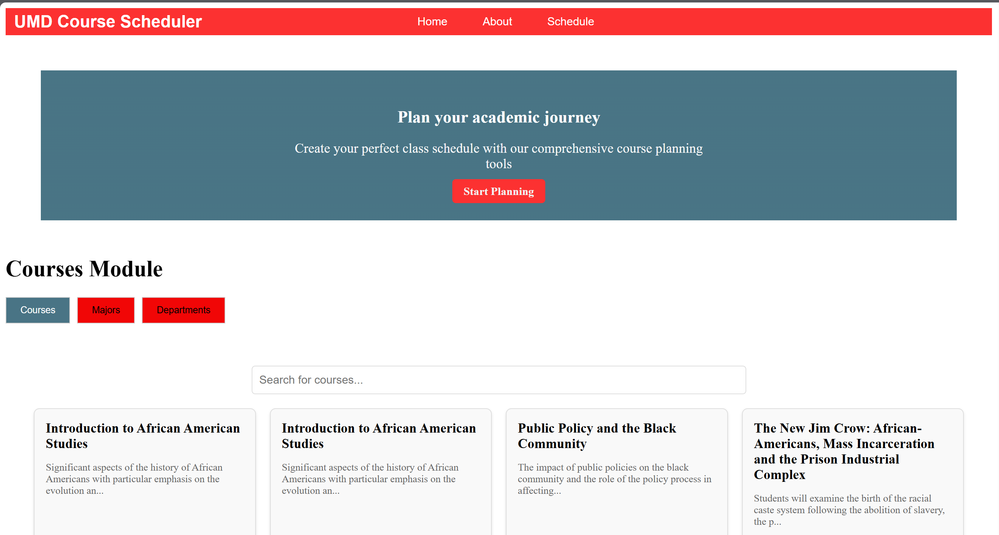
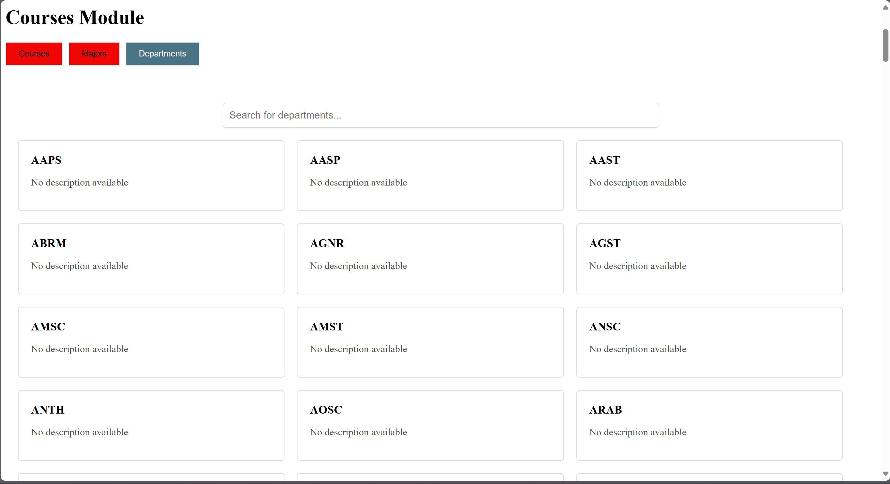
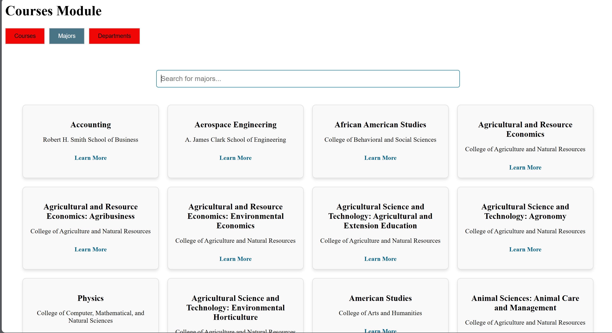
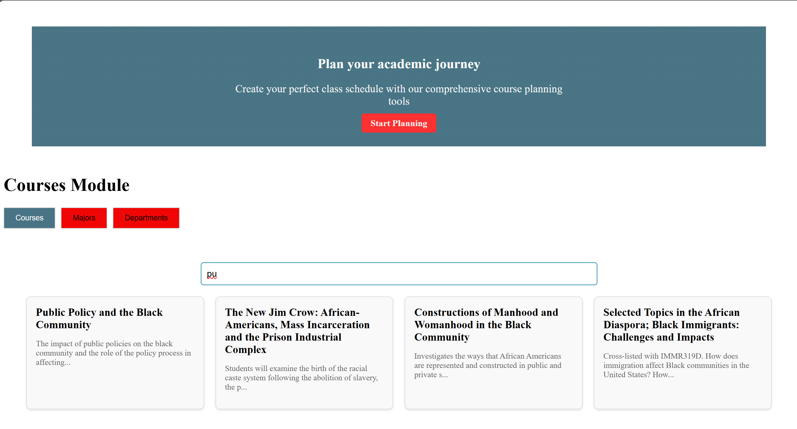

# Course Scheduler Web App
 The course scheduler is a web-based application to provide users with detailed information about the university courses, prerequisite for the courses and enable students to manage their courses by scheduling their courses.

 ## Target Browsers
  - Desktop browsers: Google Chrome, Firefox, Opera, Brave, Safari, Microsoft Edge
  - Mobile browsers: Safari(iOS), Google Chrome(Android) 

 ## Sample Screenshots
 ### Home page
 
 ### Department Page
 
 ### Majors Page
 
 ### Search Results
 


  ## Developer Manual
   ### Audience
   The maual is intended for future developers who will maintain the application. 

   ### Installation Guide
   #### Prerequisites
   - Node.js(v16.x or higher)
   - Npm (v7.x or higher)
   - Modern web browser
   - Git

   #### Installation Steps
   1. Clone the repository
   `` git clone https://github.com/your-repo-url.git ``

   2. Navigate to the project
   `` cd course-scheduler``

 ## Running the application
The application has both the frontend and backend in the same directory. runnning the application requires the developer to open different terminals for the backend and frontend

### Running the backend
1. Navigate to the project backend directory
    ``cd backend-scheduler``
2. Install the backend dependencies
    `` npm install``
 3. Strart the server
    `` node server.js`` 

    ### Runnning the Frontend
     1. Navigate to the frontend directory
    ``cd frontend_scheduler ``
    2. Install the frontend dependencies
    `` npm install``
    3. run the application
    `` npm start``
    4. Open the browser to view the UI
    `` http:localhost:3000``

    ### Production Build
     to build the application for production
    `` npm run build ``

    ### Running tests
     To run the test
    `` npm test ``


    ## API Documentation

    ### Endpoints
-  GET/courses
    - Fetches the list of available courses 
    - sample Response
    ``` json
      {
          "course_id": "AASP100",
        "semester": "202501",
        "name": "Introduction to African American Studies",
        "dept_id": "AASP",
        "department": "African American Studies",
        "credits": "3",
        "description": "Significant aspects of the history .",
        "grading_method": [
            "Regular",
            "Pass-Fail",
            "Audit"
        ],
        "gen_ed": [
            [
                "DSHS",
                "DVUP"
            ]
        ],
         "core": [],
        "relationships": {
            "coreqs": null,
            "prereqs": null,
            "formerly": null,
            "restrictions": null,
            "additional_info": null,
            "also_offered_as": null,
            "credit_granted_for": null
        },
        "sections": [
            "AASP100-0101",
            "AASP100-0301",
            "AASP100-0501",
            "AASP100-0701",
            "AASP100-0201",
            "AASP100-0401",
            "AASP100-0601"
        ]
    } ``
    
-  GET /majors
    - Fetches the majors details
    - Returns
    ``` json
     {
        "major_id": 238,
        "name": "Accounting",
        "college": "Robert H. Smith School of Business",
        "url": "https://www.rhsmith.umd.edu/programs/undergraduate/academics/academic-majors"
    },``

- POST /schedules
     - adds a new schedule to the database
     - Request body
    ``` json
        {
            "user_id":123,
            "course_id": 12023,
            "semester":"summer 2024"
        }, ``
 
 
 
 ### Future Development Roadmap
-  User Authentication: Add role-based access for students, faculty, and administrators.
    
-  Search and Filter Functionality: Enhance course search by department, semester, and credits.
    
- Data Export: Allow exporting course data in CSV and PDF formats.
    
- Integration with University APIs: Sync real-time data from the university's course catalog.
